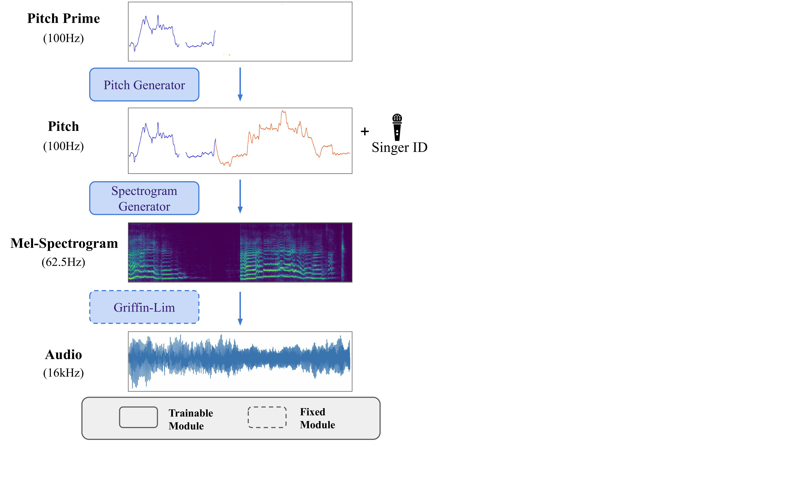

# 🎤 GaMaDHaNi: Hierarchical Generative Modeling of Melodic Vocal Contours in Hindustani Classical Music
GaMaDHaNi is a modular two-level hierarchy, consisting of a generative model on pitch contours, and a pitch contour to audio synthesis model.



:book: Read our ISMIR 2024 Paper [here](https://arxiv.org/abs/2408.12658)\
:headphones: Check out the audio samples [here](https://snnithya.github.io/gamadhani-samples/)\
:computer: Play with the interactive demo [here] 
## Installation

   ```bash
   git clone https://github.com/snnithya/GaMaDHaNi.git
   pip install -r requirements.txt
   ```

## How to use

For generating without any melodic prompt(no pitch prime)

```bash
cd GaMaDHaNi
python scripts/generate.py --pitch_model_type=diffusion --prime=False --number_of_samples=1 --download_model_from_hf=True
```

For generating with a melodic prompt(pitch prime)

```bash
cd GaMaDHaNi
python scripts/generate.py --pitch_model_type=diffusion --prime=True --number_of_samples=1 --download_model_from_hf=True 
```
Note: Currently the only pitch_model_type allowed is "diffusion", "transformer" model is soon to be released.

## BibTex
```
@article{shikarpur2024hierarchical,
  title={Hierarchical Generative Modeling of Melodic Vocal Contours in Hindustani Classical Music},
  author={Shikarpur, Nithya and Dendukuri, Krishna Maneesha and Wu, Yusong and Caillon, Antoine and Huang, Cheng-Zhi Anna},
  journal={arXiv preprint arXiv:2408.12658},
  year={2024}
}
```
