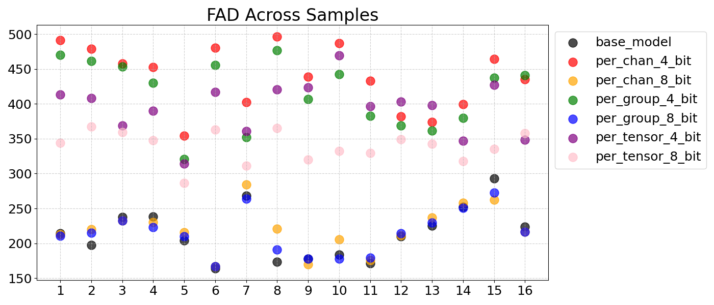
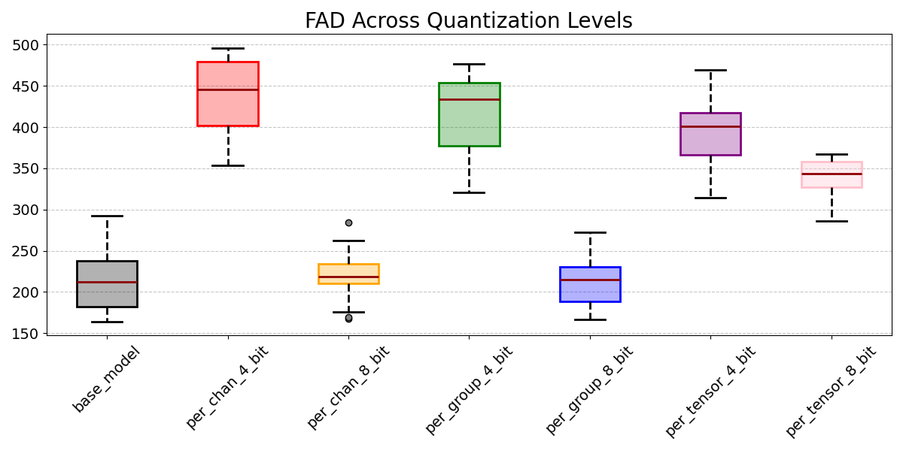

# Quantizing GaMaDHaNi
In this project, we explored various quantization schemes for audio diffusion models, focusing on [GaMaDHaNi](https://github.com/snnithya/GaMaDHaNi), a diffusion model for generating Hindustani vocal passages. Quantizing diffusion models can be especially difficult because of accumuluation of quantization errors across diffusion steps, variability in activation range between diffusion steps, and the bimodal activation distribution resulting from disparities between the activation ranges of skip connections and the tensors they are concatenated to. In addition, GaMaDHaNi uess a conditional audio diffusion model where the conditioning signals additionally cause the weight distributions to be multimodal. We developed a novel per-group quantization technique that quantizes the model weights corresponding to conditioning signals, skip connections, and layer outputs separately. 

Additionally, we evaluate our audio samples using several different audio metrics - Fréchet Audio Distance, Mel-Cepstral Distortion, and Log Spectral Distortion. By using multiple metrics, we aimed to capture different aspects of perceptual quality to obtain quantitative comparisons between our generated audio samples. Ultimately, we found that per-group 8-bit quantization produced the best results across metrics and through qualitative assessment.

The generated audio samples from each quantization scheme can be found in this repository [here](eval/examples/wavs), separated by original sample. We also created a [demo page](https://buttery-hair-d59.notion.site/151126c18dd6803b9431dcc7f7ad470e?v=5b8a8c4e23ea46979573158670f636d5) that shows three audio samples side-to-side.

Original GaMaDHaNi repo can be found [here](https://github.com/snnithya/GaMaDHaNi).
